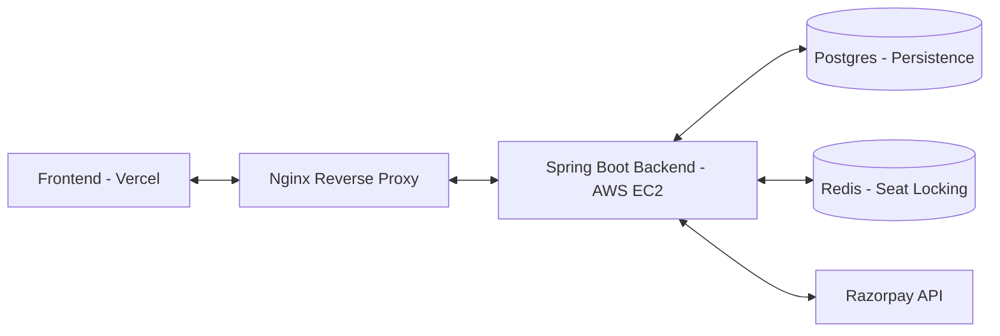

# 🎬 SimplyCinema – Highly Scalable Movie Ticketing Ecosystem

"Experience Cinema, Simplified."
SimplyCinema is a production-grade, full-stack movie ticket booking platform designed to handle complex role-based workflows, high-concurrency seat reservations, and seamless payment integrations.

---

## 🔗 Project Ecosystem

[](https://simplycinema.vercel.app)
[](https://github.com/simplyhemant/simplyCinema-frontend)
[](http://13.201.58.222:8080/swagger-ui/index.html)
[]( https://documenter.getpostman.com/view/39898850/2sB3Wnv1eV)

---

### 🚀 Quick Access
* **Web App:** [simplycinema.vercel.app](https://simplycinema.vercel.app)
* **API Specs:** [Swagger Documentation](http://your-aws-ip-or-dns:8080/swagger-ui/index.html)
* **Dev Resources:** [Postman Collection](https://github.com/simplyhemant/simplyCinema-backend/blob/main/docs/SimplyCinema_Postman.json)


## 🏗️ System Architecture

SimplyCinema follows a decoupled client-server architecture optimized for performance and security.


## 🔥 Features

### ✨ Key Features by Role

#### 👤 For Customers (Users)
*   **Search & Filter:** Find movies by city, language, genre, and dynamic formats (2D, 3D, IMAX).
*   **Live Seat Selection:** Interactive seat map with real-time status updates.
*   **One-Click Booking:** Fast and secure ticket checkout with integrated payments.
*   **Social Auth:** Instant login via Google or GitHub OAuth2.

#### 🏨 For Theatre Owners
*   **Venue Management:** Add and manage multiple cinema locations and physical screen layouts.
*   **Show Scheduling:** Full control over movie timings, screen selection, and tier-based pricing.
*   **Business Analytics:** Real-time revenue tracking and occupancy reports for all theatres.

#### 🎫 For Theatre Staff
*   **Ticket Verification:** Rapid lookup and validation of customer booking IDs.
*   **Occupancy Monitoring:** View real-time seat filling status for upcoming shows.
*   **Counter Bookings:** Manual seat reservation support for on-ground box office sales.

#### 🛡️ For Administrators
*   **Global Oversight:** Approve/Decline theatre owner registrations and maintain movie catalogs.
*   **Metadata Control:** Manage master data for cities, languages, and technical movie formats.
*   **System Security:** Monitor platform-wide activity and ensure operational integrity.

---

## 🛠️ Tech Stack

| Layer | Technologies |
| :--- | :--- |
| **Frontend** | JavaScript (ES6+), Tailwind CSS, HTML5 |
| **Backend** | Java, Spring Boot, Spring Security (JWT), Hibernate |
| **Database** | Postgres , Redis (Caching/Locking) |
| **DevOps** | AWS EC2, Nginx, Vercel, Git/GitHub |
| **Integration**| Razorpay Payment Gateway, OAuth2 |

---

## 🧠 Backend Highlights & Engineering Solutions

### 1. Concurrency Control (The "First-To-Book" Problem)
**Challenge:** Multiple users selecting the same seat at the exact same millisecond.
**Solution:** Integrated **Redis-Based Distributed Locking**. Before any database write, the system sets a Redis key for the seat with a 5-minute TTL. This ensures seats are temporarily reserved during payment and released automatically if the transaction fails, reducing DB latency by 40%.

### 2. Granular RBAC
A sophisticated **Role-Based Access Control** system using Spring Security. Permissions are mapped down to specific actions (e.g., `MANAGE_SHOWS`, `VERIFY_TICKETS`), ensuring a secure multi-tenant environment.

### 3. Scalable Scheduling
**Challenge:** Managing overlaps in a multi-screen environment.
**Solution:** Built a bulk-scheduling engine with conflict-detection logic that validates audi availability before committing to the database.

---

## 💾 Database Schema Overview
The system manages complex relationships across **12+ tables**:
* **Users & Roles:** Managed via a Many-to-Many relationship.
* **Theatre Hierarchy:** Theatre → Screen → Seat Type → Seats.
* **Mapping:** Movie ↔ Show ↔ Screen (supporting multiple formats).
* **Transaction Flow:** Booking → Payment → Coupon.

---

## 💻 Running Locally

### Frontend
1. Clone the repository:
   ```bash
   git clone [https://github.com/your-username/simply-cinema-frontend.git](https://github.com/your-username/simply-cinema-frontend.git)

   ## 🚀 Local Development Setup

   
### **Backend**
*   JDK 17 or higher
*   MySQL 8.0+
*   Redis Server (Running on default port 6379)
### **Steps**
1.  **Clone the Repo:**
    ```bash
    git clone https://github.com/simplyhemant/simplyCinema-backend.git
    cd simplyCinema-backend
    ```
2.  **Configure Environment:**
    Set the following in your `application.properties` or environment variables:
    ```properties
    spring.datasource.url=jdbc:mysql://localhost:3306/simplycinema
    spring.datasource.username=ROOT_USER
    spring.datasource.password=ROOT_PASSWORD
    spring.data.redis.host=localhost
    spring.data.redis.port=6379
    jwt.secret=YOUR_JWT_SECRET
    razorpay.key_id=YOUR_RAZORPAY_KEY
    razorpay.key_secret=YOUR_RAZORPAY_SECRET
    ```
3.  **Run Application:**
    ```bash
    ./mvnw spring-boot:run
    ```
---
## 📁 Backend Directory Structure
```text
src/main/java/com/simply/Cinema/
├── core/               # Main domain (Booking, Shows, Movies)
│   ├── controller/     # REST Controllers
│   ├── service/        # Business Logic Implementations
│   ├── repository/     # Data Persistence Layer
│   └── dto/            # Data Transfer Objects
├── security/           # JWT Filters, OAuth2 Handlers, & Security Config
├── common/             # Global exceptions, Utils, & Base classes
└── config/             # Redis, Swagger, & Payment configurations
